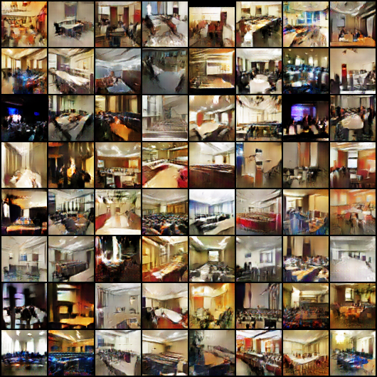
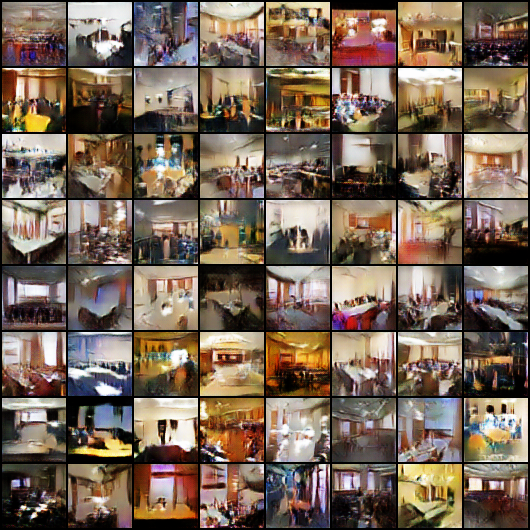
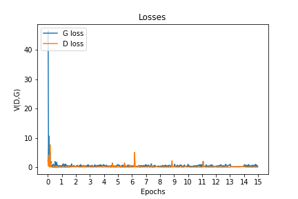

# LSGAN-pytorch
Pytorch implementation of [Least Squares Generative Adversarial Networks](https://arxiv.org/abs/1611.04076) which adopt the least squares loss function for the discriminator.

## Result

LSUN - conference room (15eps)

 
 |LSGAN | DCGAN|                                   
 |:---: | :---:|                                       
 |||

